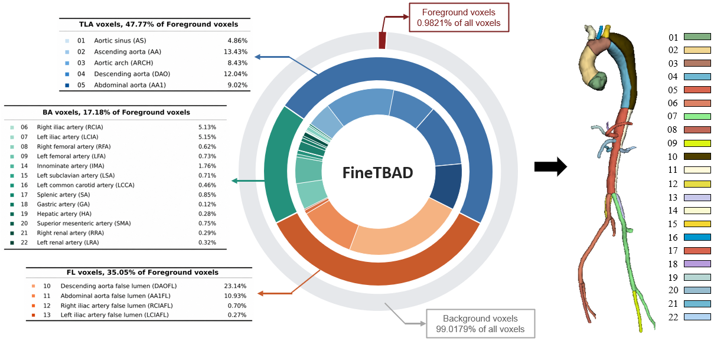
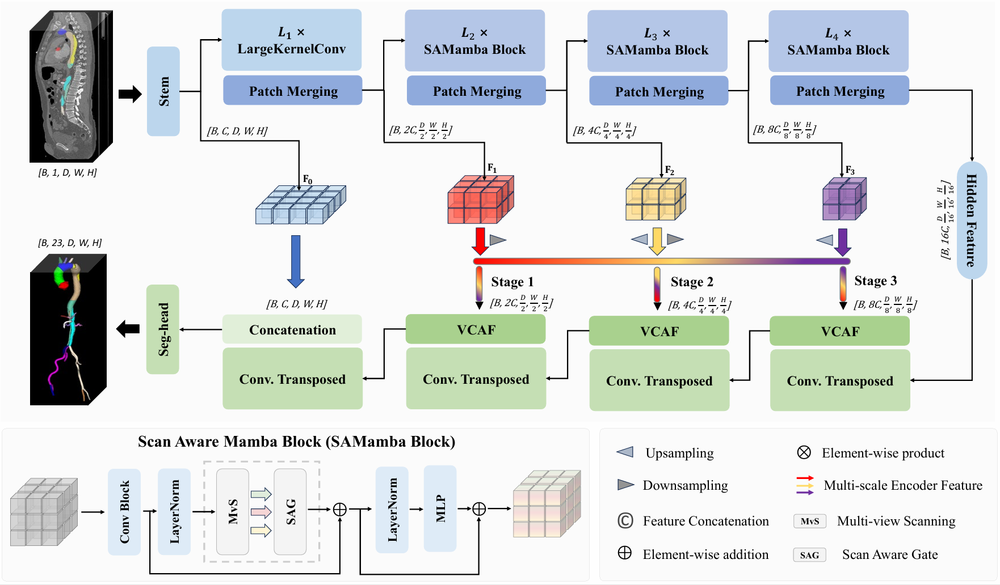

# For the paper **"Scan-Aware Mamba for Fine-grained Type-B Aortic Dissection Segmentation with Quantitative Anatomical Assessment"**

### FineTBAD Dataset
To support fine-grained TBAD segmentation, we construct **FineTBAD**, a multi-source CTA dataset comprising **125 cases** with unified annotations of up to **22 foreground classes**. The annotation protocol covers anatomically subdivided aortic regions, segment-specific false lumina, iliac and femoral arteries, and major supra-aortic and visceral branch arteries. FineTBAD is designed to support both detailed vascular segmentation and subsequent quantitative anatomical assessment.

  

### Scan-Aware Mamba
The proposed **Scan-Aware Mamba** follows a U-shaped 3D segmentation architecture for fine-grained TBAD analysis. The encoder combines convolutional feature extraction with **Scan-Aware Mamba (SAMamba) blocks**, where **Multi-view Scanning (MvS)** captures complementary anatomical context from different orthogonal views and the **Scan-Aware Gate (SAG)** adaptively integrates the resulting representations. In the decoder, the proposed **Vascular Cross-scale Attention Fusion (VCAF)** module aligns and fuses multi-scale encoder features to improve the reconstruction of vascular structures with substantial scale variation.

  

## Main Developers

- **[Author 1]**1
- **[Author 2]**1
- **[Author 3]**1,2
- **[Author 4]**2
- **[Author 5]**1

1 [Affiliation 1]  
2 [Affiliation 2]

## License

This project is licensed under the [Apache License 2.0](LICENSE).
